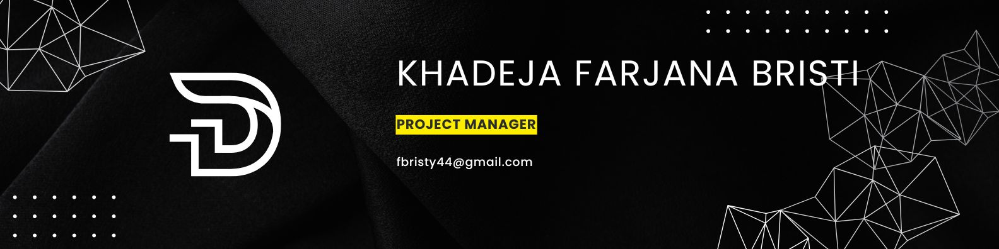

<h1 align="center">Hi 👋, I'm Khadeja Farjana Bristi</h1>
<h3 align="center">A passionate Project Manager from Bangladesh</h3>

I’m a Project Manager with a strong foundation in software engineering and a passion for delivering impactful, user-focused solutions. I specialize in bridging the gap between business goals and technical execution, ensuring projects are delivered on time, within scope, and with measurable results.
With hands-on experience in Agile methodologies, cross-functional team leadership, and data analysis, I thrive in collaborative environments where innovation meets execution. I also enjoy staying close to code—whether it's managing GitHub workflows, reviewing pull requests, or exploring the latest in data and product trends.

- 🌱 I’m currently learning **Data science and Data Analytics**

- 👨‍💻 All of my projects are available at [https://github.com/farjana-bristy](https://github.com/farjana-bristy)

- 💬 Ask me about **Project Management**

- 📫 How to reach me **fbristy44@gmail.com**

## 📊 Current Status

 

## 💻 Tech Stack:

## 🏅 Certifications

## 🔗Socials Links

# 💻 Projects:

# Library Management System

#### Features of the project:

- Developed a system for managing book lending, returns, and tracking available books.
- Included user authentication and role-based access for users and admins.
- Designed an intuitive interface with categorized listings and a responsive layout.

# Flappy Bird Game

#### Features of the project:

- Built a browser-based game using simple graphics and logic for collision detection.
- Implemented score tracking and game-over functionality.
- Focused on user experience and game mechanics.

# File Search Software

#### Features of the project:

- Created a tool that allows users to search for files across the entire local storage.
- Included search filters for file type, name, and location.
- Emphasized fast search performance and a clean UI.

# E-Banking System (Group Project)

#### Features of the project:

- Simulated an online banking system with core features like money transfer, balance checking, and transaction history.
- Included login/signup authentication and user session handling.
- Admin panel for managing user accounts and monitoring transactions.

# Reservation System (Group Project)

#### Features of the project:

- Built a reservation management platform for services or events.
- Included user authentication, booking features, and admin approval system.
- Enabled users to check availability and modify reservations.

# Electricity Billing System

#### Features of the project:

- Developed a system to calculate and manage electricity bills for residential and commercial users.
- Implemented user authentication for customers and admin roles.
- Automated bill generation based on usage with tiered pricing rates.
- Included payment tracking and history for customers.
- Admin dashboard to manage users, tariffs, and monitor payments.
- Designed a clean and responsive UI for easy navigation on all devices.
